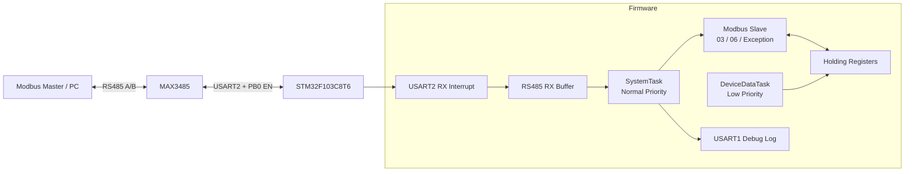
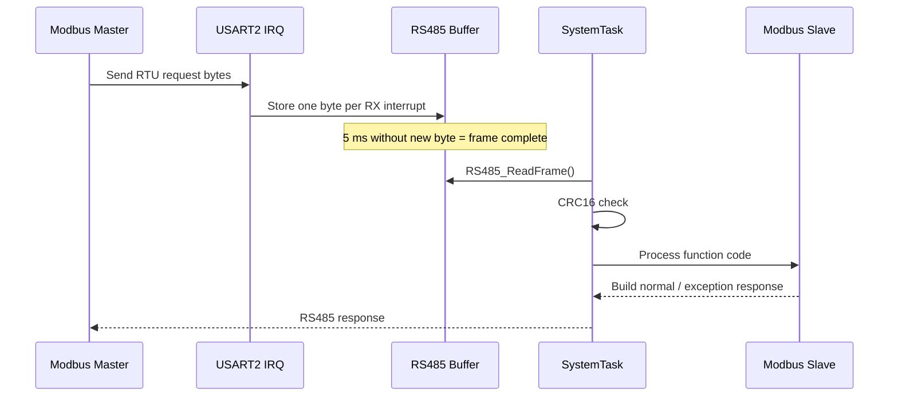

# STM32F103 FreeRTOS Modbus RTU Slave


A compact industrial-communication demo built with **STM32F103C8T6 + FreeRTOS + MAX3485**.  
The firmware implements a Modbus RTU slave over half-duplex RS485, supports standard exception responses, maintains runtime diagnostic registers, and demonstrates safe data sharing between FreeRTOS tasks.

> 中文简介：这是一个基于 **STM32F103C8T6、FreeRTOS、MAX3485** 的 Modbus RTU 从机项目，用于展示 STM32 外设驱动、RS485 半双工通信、Modbus 协议处理、中断接收、CRC16、FreeRTOS 多任务以及共享数据保护等嵌入式开发能力。

---

## Highlights

- STM32F103C8T6 @ 72 MHz
- FreeRTOS / CMSIS-RTOS V1
- MAX3485 half-duplex RS485 transceiver
- USART2 Modbus RTU communication: **9600, 8N1**
- USART1 debug console: **115200, 8N1**
- Modbus slave address: **0x01**
- Function code `0x03`: Read Holding Registers
- Function code `0x06`: Write Single Register
- Standard Modbus exception responses: `0x01`, `0x02`, `0x03`
- Modbus CRC16 checking and startup CRC self-test
- USART2 byte-by-byte interrupt reception
- 128-byte receive buffer
- 5 ms silent-gap frame detection
- FreeRTOS task separation for protocol processing and device-data refresh
- Critical sections used to protect shared holding-register data
- Remote PC13 LED control through a holding register
- Runtime counters for valid frames, CRC errors, exceptions and device status

---

## System Architecture



### Runtime flow



---

## Hardware

| Item | Configuration |
|---|---|
| MCU | STM32F103C8T6 |
| System clock | 72 MHz |
| RTOS | FreeRTOS / CMSIS-RTOS V1 |
| RS485 transceiver | MAX3485, 3.3 V |
| Debug UART | USART1, 115200, 8N1 |
| Modbus UART | USART2, 9600, 8N1 |
| Status LED | PC13, active low |
| RS485 direction control | PB0 |

### Wiring

```text
STM32 PA2  -> MAX3485 RXD / DI path used by module
STM32 PA3  -> MAX3485 TXD / RO path used by module
STM32 PB0  -> MAX3485 EN
STM32 3.3V -> MAX3485 VCC
STM32 GND  -> MAX3485 GND

MAX3485 A   -> USB-RS485 A
MAX3485 B   -> USB-RS485 B
MAX3485 GND -> USB-RS485 GND
```

> The exact DI/RO silk-screen naming can vary between MAX3485 modules. Follow the signal direction of the module you are using.

Recommended checks:

- Use 3.3 V supply for the MAX3485 module used in this project.
- STM32, MAX3485 and USB-RS485 must share ground.
- Keep A/B connections firm; poor terminal contact can cause dropped bytes and CRC errors.
- Prefer a short twisted pair for A/B during bench testing.

---

## FreeRTOS Task Design

| Task | Priority | Stack | Responsibility |
|---|---:|---:|---|
| `SystemTask` | Normal | 256 | Read completed RS485 frames, validate CRC, process Modbus requests, send responses and print debug logs |
| `DeviceDataTask` | Low | 128 | Refresh uptime, LED actual state and device-status register once per second |

Shared holding-register data is accessed inside FreeRTOS critical sections where atomic multi-register updates are required.

---

## Holding Register Map

| Address | Name | Access | Description |
|---:|---|---|---|
| 0 | Uptime Seconds | RO | Low 16 bits of device uptime in seconds |
| 1 | Valid Frame Count | RO | CRC-valid frames addressed to this slave |
| 2 | CRC Error Count | RO | Number of received frames with CRC errors |
| 3 | LED Control | RW | `0` = LED off, `1` = LED on |
| 4 | LED Actual State | RO | Actual PC13 LED state |
| 5 | Last Function Code | RO | Most recently recorded Modbus function code |
| 6 | Exception Count | RO | Number of generated Modbus exception responses |
| 7 | Device Status | RO | Combined device status bit field |

### Device-status bits

| Bit | Mask | Meaning |
|---:|---:|---|
| bit0 | `0x0001` | Device is running |
| bit1 | `0x0002` | LED is actually on |
| bit2 | `0x0004` | At least one valid frame has been received |
| bit3 | `0x0008` | A CRC error has occurred |
| bit4 | `0x0010` | An exception response has been generated |

Example:

```text
0x0001 | 0x0004 = 0x0005
```

`0x0005` means the device is running and has received at least one valid frame.

---

## Modbus Request Processing

### Function `0x03` — Read Holding Registers

The slave validates:

1. request length;
2. register quantity;
3. start address;
4. requested address range;
5. response-buffer capacity.

The selected registers are copied while task switching is temporarily blocked so one Modbus response observes a consistent register snapshot.

### Function `0x06` — Write Single Register

The writable control point in this demo is the LED-control register. Invalid addresses or invalid values are returned as standard Modbus exception responses.

### Exception responses

| Exception | Code | Meaning |
|---|---:|---|
| Illegal Function | `0x01` | Unsupported Modbus function |
| Illegal Data Address | `0x02` | Requested register address is outside the valid map |
| Illegal Data Value | `0x03` | Request length, quantity or value is invalid |

---

## Test Frames

### Read all 8 holding registers

Request:

```text
01 03 00 00 00 08 44 0C
```

Response format:

```text
01 03 10 [16 bytes register data] [CRC Lo] [CRC Hi]
```

### Turn LED on

```text
01 06 00 03 00 01 B8 0A
```

Expected response: request frame echoed back.

### Turn LED off

```text
01 06 00 03 00 00 79 CA
```

Expected response: request frame echoed back.

### CRC error test

Send a deliberately incorrect CRC:

```text
01 03 00 00 00 08 44 0D
```

Expected behavior:

- no Modbus response;
- CRC error counter increments;
- device-status CRC-error bit becomes set.

---

## Debug Output

USART1 is used as a lightweight diagnostic console.

```text
[BOOT] Modbus functions 03/06 slave started
[CRC SELF TEST] PASS

[MODBUS RX] 01 03 00 00 00 08 44 0C
[MODBUS] CRC OK
[MODBUS TX] 01 03 10 ...
[MODBUS] TX OK
```

This makes communication faults easier to separate into reception, CRC, protocol and transmission stages.

---

## Project Structure

```text
STM32F103-FreeRTOS-Modbus-RTU/
├── Core/
│   ├── Inc/
│   │   ├── modbus_crc.h
│   │   ├── modbus_slave.h
│   │   └── rs485.h
│   └── Src/
│       ├── modbus_crc.c
│       ├── modbus_slave.c
│       ├── rs485.c
│       └── freertos.c
├── Drivers/
├── Middlewares/
├── MDK-ARM/
├── ModbusRTUTerminal.ioc
├── .gitignore
└── README.md
```

### Main modules

- `rs485.c` — MAX3485 direction switching, USART2 interrupt reception, frame buffering and RS485 transmission.
- `modbus_crc.c` — Modbus CRC16 calculation and frame validation.
- `modbus_slave.c` — register map, function codes `0x03` / `0x06`, exception responses, counters, status and LED control.
- `freertos.c` — RTOS task creation, protocol-processing loop, periodic device-data update and debug logging.

---

## Build and Run

### Keil MDK-ARM

1. Open `MDK-ARM/ModbusRTUTerminal.uvprojx` in Keil MDK-ARM.
2. Build the project.
3. Flash the STM32F103C8T6 with ST-Link.
4. Connect USART1 to a serial terminal at `115200 8N1`.
5. Connect USART2 through the MAX3485 to a USB-RS485 adapter.
6. Configure the Modbus master as `9600 8N1`, RTU mode, slave address `1`.

### STM32CubeMX

Open `ModbusRTUTerminal.ioc` to inspect or regenerate the peripheral and FreeRTOS configuration. Review user-code sections before regenerating code.

---

## Verified Behaviors

The current project has been used to verify:

- `0x03` holding-register reads;
- `0x06` single-register writes and LED control;
- exception codes `0x01`, `0x02`, `0x03`;
- CRC-error rejection and error counting;
- periodic dynamic-register updates;
- repeated polling communication;
- consistency between LED control and actual LED-state feedback.

---

## What This Project Demonstrates

This repository is intentionally small, but it covers several practical embedded-software topics:

- STM32 HAL peripheral configuration
- UART interrupt reception
- half-duplex RS485 direction control
- Modbus RTU frame parsing
- CRC16 implementation
- protocol exception handling
- FreeRTOS task design
- shared-data synchronization
- embedded diagnostic logging
- hardware/software integration and communication debugging

---

## Roadmap

- [ ] Add watchdog and communication recovery
- [ ] Add UART error callback and automatic RX restart
- [ ] Add Modbus function `0x10` (Write Multiple Registers)
- [ ] Map real sensor data into holding/input registers
- [ ] Add Flash-backed parameter storage
- [ ] Add a PC monitoring/configuration tool
- [ ] Add hardware photos, wiring diagram and protocol-test screenshots

---

## 中文说明

这个仓库主要作为嵌入式项目作品集使用。项目重点不是简单调用 Modbus 库，而是把 **RS485 接收、帧边界判断、CRC 校验、协议解析、异常响应、FreeRTOS 任务以及运行状态统计** 拆分成清晰模块，便于后续继续扩展传感器、参数存储和上位机功能。
